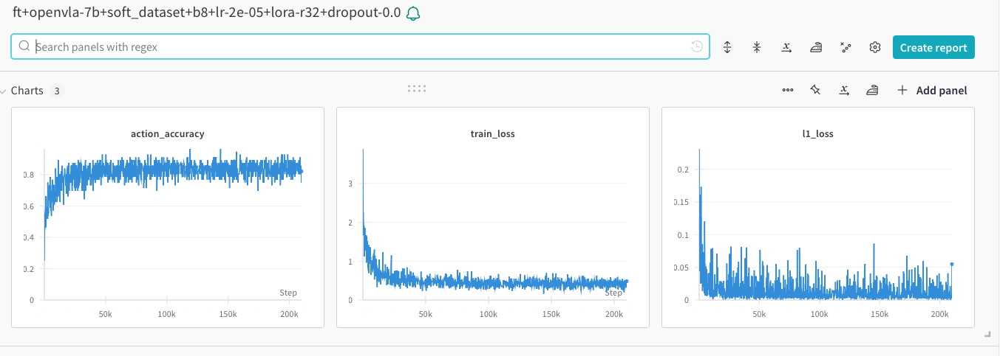

# openvla-finetune

Repository for finetuning OpenVLA models on custom datasets.

## Structure

```
-- dataset (prepare/create the custom dataset)
-- prismatic (OpenVLA model)
-- finetune.py (finetuning script)
-- inference.py (inference script)
```

## Environment setup

1. Clone the repository
2. Create conda environment with dependencies
```bash
conda env create -f environment_macos.yml # for MacOS
conda env create -f environment_ubuntu.yml # for Linux
```

## Dataset creation

Open-Embodied X dataset and implicitly OpenVLA use the RLDS format for the dataset. An explanation of the RLDS format can be found [here](https://github.com/google-research/rlds).

## Finetuning

**TODO**

## Inference

**TODO**

## Examples

Finetuning on out-of-distribution robots:


